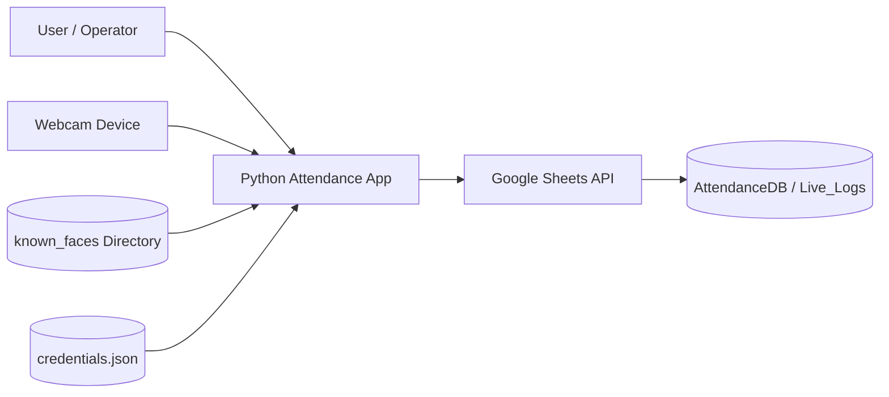
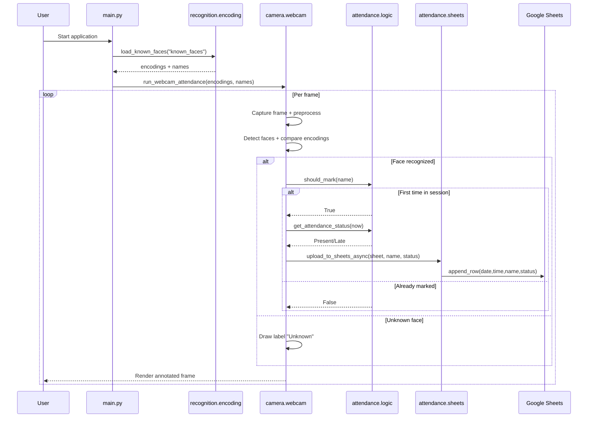
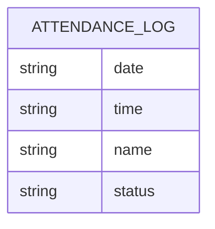
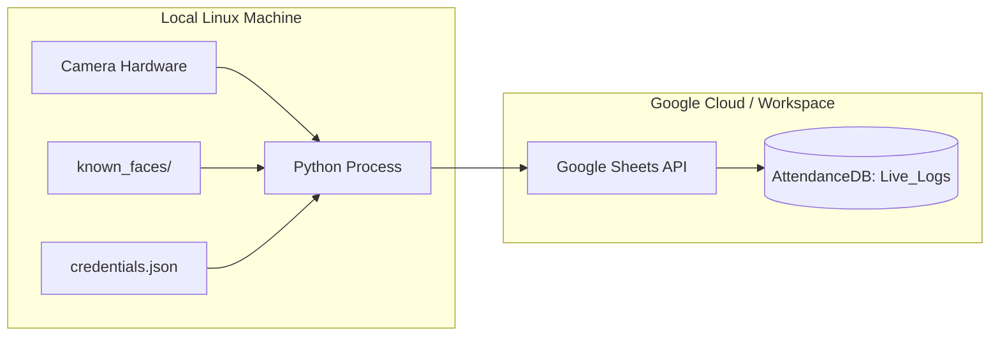

# System Architecture

This document describes the current architecture of the Scan Face Attendance system.

## 1) High-Level Context



## 2) Module Architecture

```mermaid
flowchart TB
    subgraph Entry
      Main[main.py\nmain()]
    end

    subgraph Recognition
      Encoding[recognition/encoding.py\nload_known_faces()]
    end

    subgraph Camera
      Webcam[camera/webcam.py\nrun_webcam_attendance()]
      Scale[_scale_frame()]
      RGB[_to_rgb()]
      Resolve[_resolve_name()]
      Draw[_draw_label()]
    end

    subgraph Attendance
      Logic[attendance/logic.py\nget_attendance_status()\nshould_mark()]
      Sheets[attendance/sheets.py\nopen_live_logs_sheet()\nupload_to_sheets()\nupload_to_sheets_async()]
    end

    subgraph Utilities
      Logging[utils/logging_config.py\nconfigure_logging()]
    end

    Main --> Logging
    Main --> Encoding
    Main --> Webcam

    Webcam --> Scale
    Webcam --> RGB
    Webcam --> Resolve
    Webcam --> Draw

    Webcam -. optional callback .-> Logic
    Logic -. result status .-> Sheets
```

## 3) Runtime Sequence (Recognition + Attendance Logging)



## 4) Data Model (Attendance Row)



Row format appended to `Live_Logs`:

1. `date` -> `YYYY-MM-DD`
2. `time` -> `HH:MM:SS`
3. `name` -> recognized person label from file stem
4. `status` -> `Present` or `Late`

## 5) Key Design Decisions

- Recognition startup preload: known face encodings are loaded once at startup.
- Frame optimization: frames are downscaled (`scale_factor=0.25`) before face detection.
- Session deduplication: `should_mark()` prevents duplicate attendance marks per process run.
- Resilience: sheets upload errors are logged and do not crash the camera loop.
- Separation of concerns:
  - camera loop and rendering in `camera/`
  - recognition loading in `recognition/`
  - attendance rules and persistence in `attendance/`
  - logging setup in `utils/`

## 6) Deployment View (Current)



## 7) Suggested Future Extensions (Optional)

- Add persistent local store (SQLite) as fallback queue when Sheets API is unavailable.
- Add configuration file for camera index, cutoff time, and sheet names.
- Add health-check and metrics (rows uploaded, recognition FPS, API retries).
- Add packaging entrypoint (`python -m app`) for cleaner distribution.
